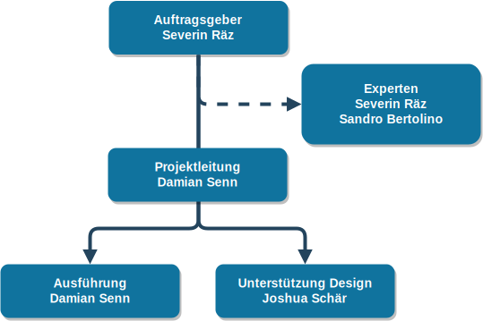

# Ausgangslage

## Allgemein

# Projektziele

## Begründung der Projektziele

# Terminplan

| Phase           | Datum                   | Stunden |
|-----------------+-------------------------+---------|
| Initialisierung | 06.03.2019 - 00.00.0000 |      42 |
| Studie          |                         |         |
| Konzept         |                         |         |
| Realisierung    |                         |         |
| Abschluss       |                         |         |

# Organigramm

## Tätigkeiten im Projekt

| Name             | Funktions- und Tätigkeitsbereich |
|------------------+----------------------------------|
| Severin Räz      | Auftraggeber, externer Experte   |
| Sandro Bertolino | Interner Experte                 |
| Damian Senn      | Projektleiter, Ausführung        |

# Abgrenzungen

### Hardware, Server-Installation, Deployment und Monitoring

Da das Projekt ein reines Software-Entwicklungs Projekt ist, werden keine
Operativen tätigkeiten wie Hardware beschaffung, Server-Installation,
Deployment und das einrichten eines Monitoring-Systems vorgenommen.

### Datenschutz

Da das Projekt nicht deployed wird und somit nicht produktiv/online gestellt
wird, müssen im Rahmen dieser Projektarbeit noch keine Gedanken über den
Datenschutz gemacht werden.

### Datenimport

Da wir bisher keine existierenden Konzertdaten besitzen, ist es nicht nötig,
einen Datenimport zu implementieren.

### Datenabfüllung

Die Projektarbeit beinhaltet kein Datenset, Tests werden mit Testdaten
abgewickelt. Es liegt nicht in der Verantwortung des Projektleiters, dass
Daten in die Applikation abgefüllt werden.

### Backup Konzept

Es wird kein Backup Konzept benötigt, da die Applikation im Rahmen dieses
Projektes nicht produktiv geschaltet wird.

# Wirtschaftlichkeit

## Break Even Analyse
